# Optimization Benchmarks

This page is a running slide-style record of optimization benchmark jobs for the differentiable FEL workflow.

## Benchmark Record

### 2026-04-14: Seeded FEL gradient restart

Goal: restart from a seeded FEL case with `P0 = 1e6 W`, initialize from the resonant no-taper `K` profile, and run gradient-only taper optimization.

Artifacts for this run are generated by:

```bash
python scripts/seeded_gradient_restart.py
```

Plots and summaries are written to `docs/examples/generated_plots/seeded_gradient_restart_2026-04-14/`.

#### Taper profile

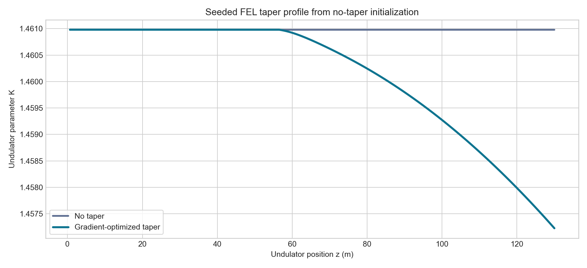

#### Power growth

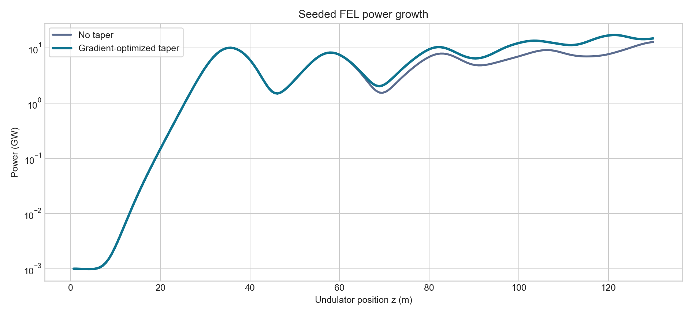

#### Optimization history

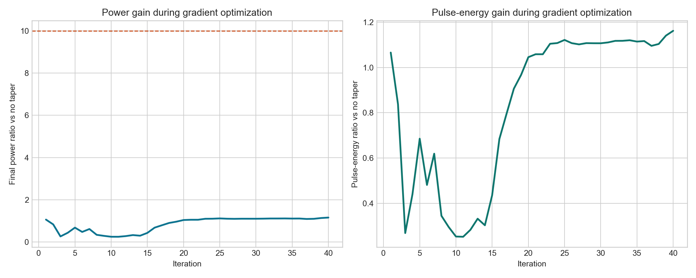

#### Flexible-control follow-up

Artifacts for the higher-dimensional flexible taper test are written to `docs/examples/generated_plots/seeded_gradient_flexible_2026-04-14/`.

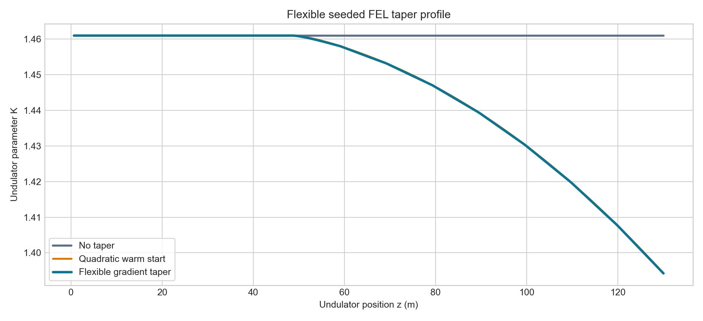

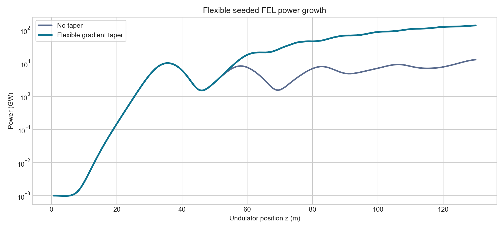

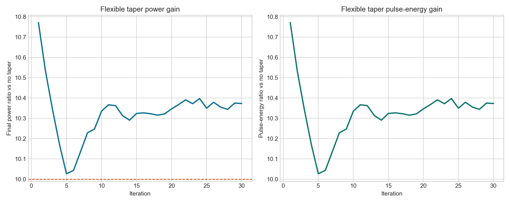

#### Notes

- This run uses a seeded 8 GeV, 9.8 keV case with resonant `K0` and a fixed initial bucket.
- The optimizer starts from exactly no taper and uses only gradient-based updates.
- Current best run with the 3-parameter physical taper model:
  start position + linear slope + quadratic slope.
- Seed power is `1e6 W`, no-taper final power is `12.796 GW`, and the best gradient-optimized taper reached `152.311 GW`.
- Final power gain vs no taper: `11.903x`.
- Best iterate was `36`, with `K` tapering from `1.461` down to `1.347`.
- The optimizer can overshoot later, so the script records and plots the best iterate rather than the last iterate.
- Follow-up run with tiny nonzero initial taper:
  this was added so taper start would get gradient signal immediately instead of starting from an exactly flat profile.
- Follow-up run result:
  best iterate `9`, final power `136.182 GW`, power gain `10.642x`, with `K` tapering from `1.461` down to `1.394`.
- Follow-up run interpretation:
  the tiny initial taper improved convergence speed and still found a `>10x` solution, but it did not materially move the taper earlier.
- Follow-up run interpretation:
  the fitted taper start stayed late at about `start_frac = 0.373`, compared with about `0.383` in the earlier `11.9x` run.
- Option 2 test:
  I changed the parameterization to decouple taper start from taper strength by using `start_frac`, end amplitude, and curvature as the 3 control variables.
- Option 2 result:
  this version underperformed badly in the current tuning, reaching only `1.162x` final power gain, with a fitted `start_frac = 0.432` and a very small learned taper amplitude.
- Option 2 lesson:
  decoupling start from amplitude is not enough by itself. In the current objective and optimizer tuning, the model collapses toward a weak-taper solution instead of learning an earlier strong taper.
- Current working configuration:
  reverted to the previous 3-parameter model `start + linear + quadratic`, which is the latest usable setup and still supports `>10x` gain.
- Flexible-control follow-up:
  I added a separate high-dimensional taper model in `scripts/seeded_gradient_flexible.py` with one start parameter, one end-amplitude parameter, and `8` monotone shape controls.
- Flexible-control result:
  the first run reached only `29.927 GW`, or `2.339x` over the `12.796 GW` no-taper baseline.
- Flexible-control change:
  the new model uses a monotone interpolated taper shape so gradient-based optimization has more control degrees of freedom than the 3-parameter model.
- Flexible-control lesson:
  more control parameters alone do not automatically help. With the current objective and initialization, the extra shape freedom makes the optimization problem harder and underperforms the simpler 3-parameter taper.
- Flexible-control next step:
  warm-start the flexible shape from the successful quadratic taper or regularize the shape around that baseline instead of starting from a nearly flat generic shape.
- Flexible warm-start follow-up:
  I warm-started the high-dimensional taper from the successful `>10x` quadratic solution instead of a generic shape.
- Flexible warm-start result:
  the best iterate was the very first one, with `137.836 GW` and `10.771x` gain over no taper.
- Flexible warm-start lesson:
  the extra shape controls can preserve a strong solution when initialized well, but in this run they did not improve beyond the simpler quadratic taper.
- Flexible warm-start lesson:
  this suggests the main bottleneck is no longer parameterization flexibility alone; the objective or optimizer needs to actively exploit the added degrees of freedom, otherwise the warm start is already near a local optimum.
- Lessons learned:
  the big gain came only after enforcing an exact no-taper start, while keeping nonzero gradient signal.
- Lessons learned:
  using `softplus(theta) - log(2)` for the taper coefficients made `theta = 0` correspond exactly to zero taper; the earlier version accidentally started from a nonzero taper and gave misleading behavior.
- Lessons learned:
  the simple 3-parameter physical model worked once it was allowed to explore a stronger taper range; the earlier conservative coefficient scales kept the optimizer in a weak-taper regime.
- Lessons learned:
  optimizing primarily for final power worked better here than mixing in extra pulse-energy weighting.
- Lessons learned:
  weaker lower-`K` and smoothness penalties were necessary; overly strong regularization prevented the optimizer from reaching the high-gain seeded taper regime.
- Process note:
  after each run, record the figures, key metrics, what changed, and the main lesson here before moving on to the next idea.

### 2026-04-15: Seeded FEL gradient restart with 2 GW seed

Goal: rerun the working 3-parameter seeded gradient optimizer with a much stronger seed power, `P0 = 2e9 W`, and check whether the previous taper strategy still gives large gain.

Artifacts for this run are generated by:

```bash
python scripts/seeded_gradient_restart.py
```

Plots and summaries are written to `docs/examples/generated_plots/seeded_gradient_restart_2026-04-15/`.

#### Taper profile

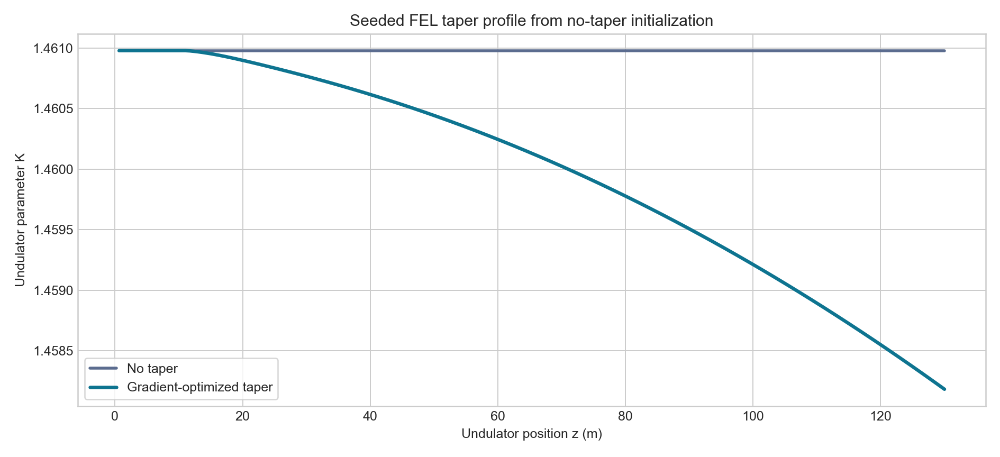

#### Power growth

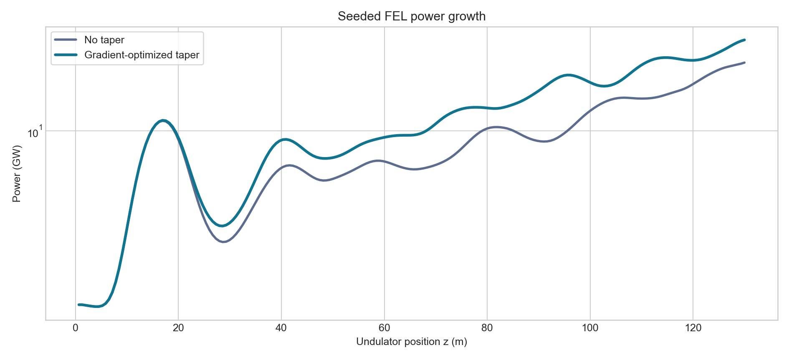

#### Optimization history

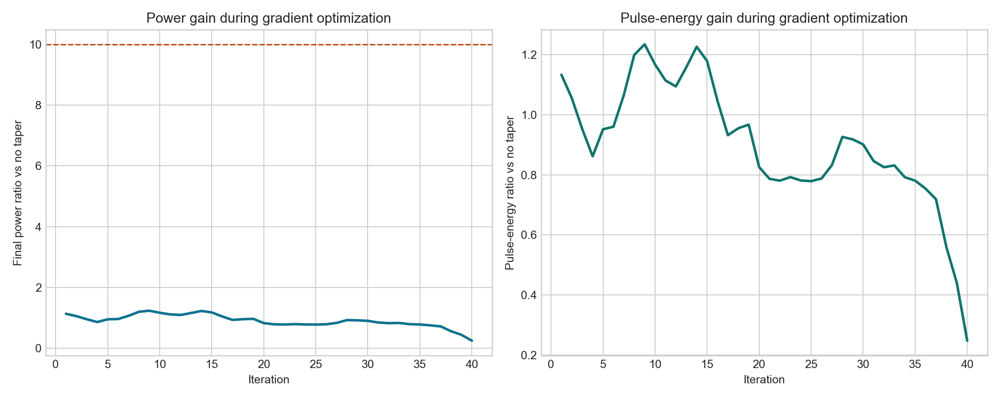

#### Notes

- Configuration:
  same 3-parameter `start + linear + quadratic` taper model as the successful 1 MW run, but with seed power changed from `1e6 W` to `2e9 W`.
- Result:
  no-taper baseline increased to `18.816 GW`, but the best optimized result was only `30.942 GW`, or `1.644x`, at iteration `2`.
- Change from previous run:
  this isolates seed power as the main change; the taper parameterization and gradient optimizer stayed the same.
- Lesson:
  the taper strategy that works well at `1e6 W` does not transfer directly to `2e9 W`. The stronger seed changes the optimization landscape enough that the run rises briefly and then collapses.
- Lesson:
  for the 2 GW seeded case, the current objective and learning-rate setup are too aggressive or misaligned; they do not preserve the early improvement.
- Next step:
  retune the objective or step size specifically for the high-seed regime before drawing conclusions from this case.
- Oscillation-penalty follow-up:
  I added a differentiable post-saturation oscillation penalty to the objective so the optimizer would explicitly dislike power dips after saturation.
- Oscillation-penalty result:
  the best iterate remained the same at `30.942 GW`, or `1.644x`, and the later collapse still occurred.
- Oscillation-penalty lesson:
  this penalty by itself is not strong enough or not activated early enough to change the optimization path in the 2 GW regime.
- Oscillation-penalty lesson:
  the problem in the strong-seed case is more fundamental than just missing a smoothness term after saturation; the whole taper strategy likely needs retuning for that regime.
- Early-start retune follow-up:
  I changed the taper-start search window to favor earlier starts and reduced the learning rate for the `2 GW` seeded case.
- Early-start retune result:
  the best run reached `35.535 GW`, or `1.889x` over the `18.816 GW` no-taper baseline, which is better than the previous `1.644x`.
- Early-start retune result:
  the optimized taper start moved to `start_frac = 0.085`, much earlier than the previous `~0.371`.
- Early-start retune lesson:
  for the strong-seed regime, the optimizer was not refusing early taper on physics grounds; it was being held back by the parameterization window and optimization dynamics.
- Early-start retune lesson:
  forcing the start search earlier and using a smaller step size produces a materially earlier taper and a better result, even though the overall gain is still far below the `1 MW` case.
- Negative-slope penalty follow-up:
  I changed the oscillation term to penalize negative post-saturation log-power slope directly, instead of squaring the negative slope.
- Negative-slope penalty result:
  the latest run regressed to `23.218 GW`, or `1.234x` over the `18.816 GW` no-taper baseline, with best iterate `9`.
- Negative-slope penalty result:
  the fitted taper remained shallow, with `K` only moving from `1.461` down to `1.458`.
- Negative-slope penalty change from previous run:
  the seed power, 3-parameter taper model, and early-start search window stayed the same; the only intended objective change was the oscillation term shape.
- Negative-slope penalty lesson:
  penalizing negative post-saturation slope in this simple form is too restrictive or poorly aligned with the strong-seed objective, and it suppresses useful taper strength instead of guiding an earlier, better taper.
- Negative-slope penalty lesson:
  the current best-known `2 GW` result is still the earlier-start retune at `35.535 GW` and `1.889x`; this latest option-2 run is a regression, not an improvement.
- Next step:
  keep the earlier-start retune as the strong-seed baseline and, if oscillation control is still needed, target the post-saturation region more explicitly without weakening the overall taper amplitude.

### 2026-04-15: Seeded FEL gradient restart with 200 MW seed

Goal: rerun the same 3-parameter seeded gradient optimizer at an intermediate seed power, `P0 = 2e8 W`, to see whether the optimization behaves more like the unstable `2 GW` case or the high-gain `1 MW` case.

Artifacts for this run are generated by:

```bash
python scripts/seeded_gradient_restart.py
```

Plots and summaries are written to `docs/examples/generated_plots/seeded_gradient_restart_p2e8_2026-04-15/`.

#### Taper profile

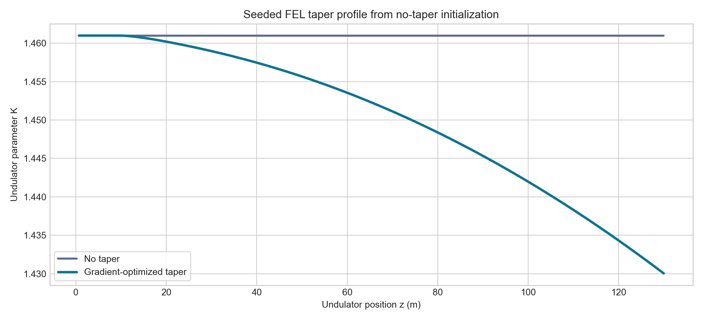

#### Power growth

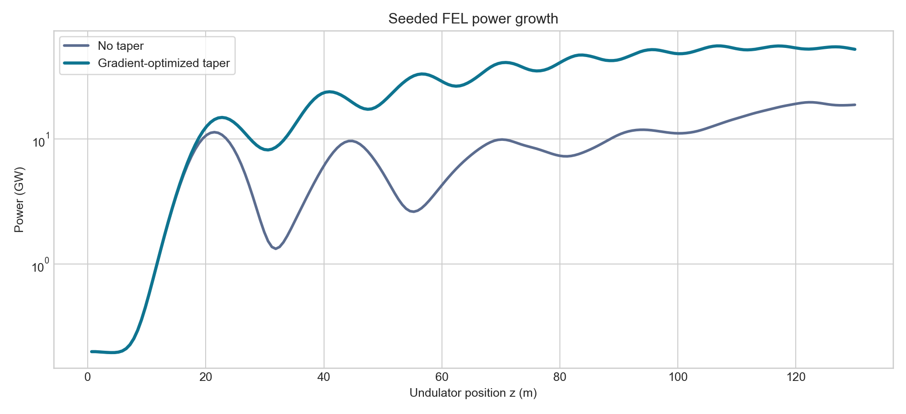

#### Optimization history

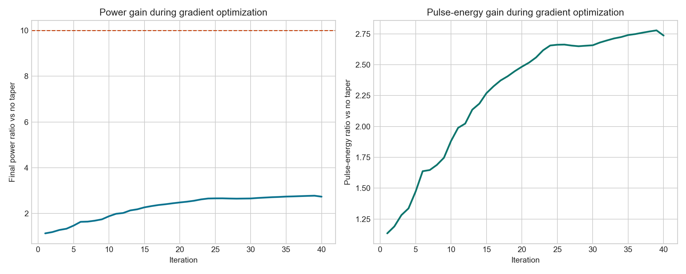

#### Notes

- Configuration:
  same `start + linear + quadratic` taper model and same early-start search window as the retuned strong-seed setup, but with seed power reduced from `2e9 W` to `2e8 W`.
- Result:
  the no-taper baseline is `18.841 GW`, and the best optimized result reached `52.348 GW`, or `2.778x`, at iteration `39`.
- Result:
  the fitted taper start is `start_frac = 0.0736`, and the optimized taper spans from `K = 1.461` down to `K = 1.430`.
- Change from previous run:
  only the seed power changed materially; this run keeps the same 3-parameter taper family and strong-seed-oriented optimization setup.
- Lesson:
  reducing the seed from `2 GW` to `200 MW` makes the optimization much healthier. The run keeps improving through late iterations instead of peaking immediately and collapsing.
- Lesson:
  the optimizer still prefers an early taper start in this stronger-seed regime, but the intermediate seed allows a significantly deeper and more effective taper than the `2 GW` case.
- Lesson:
  this intermediate point suggests the loss of performance at `2 GW` is not just about taper start location; the seed level itself changes how much taper depth the optimizer can use productively.
- Next step:
  compare the `200 MW` and `2 GW` power-growth curves directly and retune the objective for stronger extraction at high seed without suppressing taper depth.

### 2026-04-15: Seeded FEL piecewise-linear taper with 200 MW seed

Goal: replace the quadratic taper shape with a more flexible piecewise-linear taper while keeping gradient-only optimization, then test whether the extra control freedom improves the current `200 MW` seeded result.

Artifacts for this run are generated by:

```bash
python scripts/seeded_gradient_piecewise_linear.py
```

Plots and summaries are written to `docs/examples/generated_plots/seeded_gradient_piecewise_linear_p2e8_2026-04-15/`.

#### Taper profile

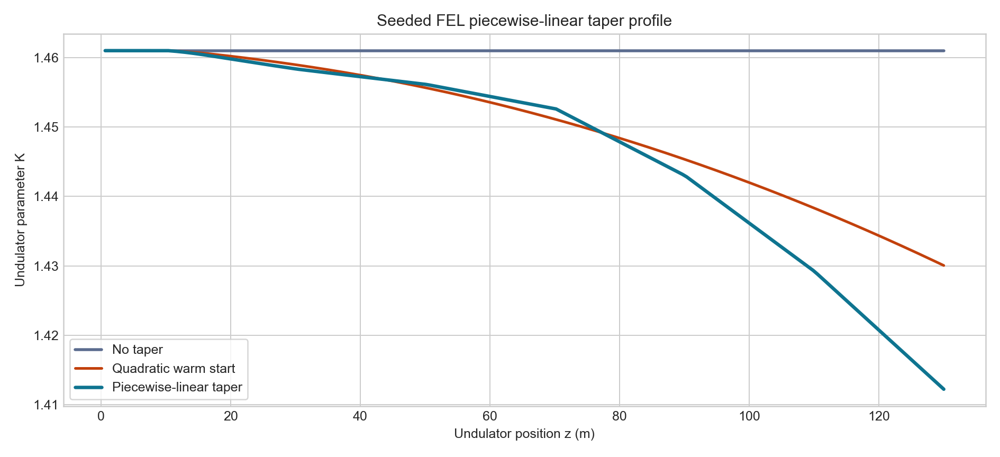

#### Power growth

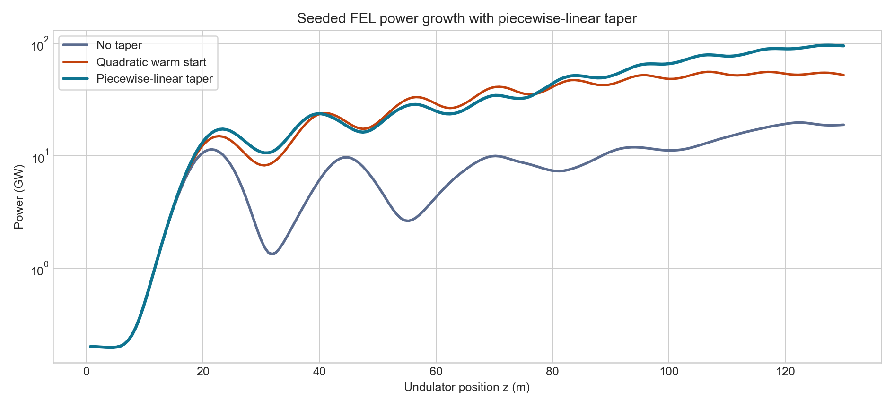

#### Optimization history

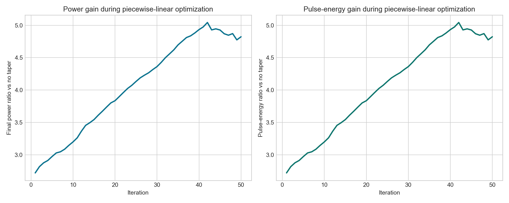

#### Notes

- Configuration:
  this run uses a new piecewise-linear taper model with `1` taper-start parameter plus `6` positive knot increments that are cumulatively summed and linearly interpolated into the full `K(z)` profile.
- Configuration:
  the seed power remains `P0 = 2e8 W`, and the objective keeps the same monotonicity, upper/lower `K`, smoothness, and post-saturation negative-slope penalties as the current restart script.
- Change from previous run:
  instead of optimizing only `start + linear + quadratic`, this run warm-starts the piecewise-linear control points from the successful `200 MW` quadratic taper and then optimizes in the higher-dimensional control space.
- Result:
  the no-taper baseline is `18.841 GW`, the quadratic warm start is `52.348 GW`, and the best piecewise-linear taper reaches `95.014 GW`, or `5.043x` over no taper, at iteration `42`.
- Result:
  compared with the previous quadratic `200 MW` result, the piecewise-linear model improves final power by `42.666 GW`, which is `1.815x` better than the quadratic optimum.
- Result:
  the fitted taper start stays early at `start_frac = 0.0750`, while the taper deepens further to `K_min = 1.412`.
- Lesson:
  the extra control freedom is helping in a real way here. Starting from the quadratic solution, the optimizer uses the piecewise-linear knots to keep the same early taper onset but extract substantially more power downstream.
- Lesson:
  warm-starting matters. This run shows the higher-dimensional parameterization can outperform the simpler taper once it begins in a physically good basin, rather than from a flat or generic initialization.
- Lesson:
  for the `200 MW` case, piecewise-linear tapering is now the best-known seeded result in the repo, and it is the clearest example so far of gradient-based optimization benefiting from a richer control parameterization.
- Next step:
  inspect the optimized piecewise-linear knot pattern and decide whether to increase the number of knots further or use this parameterization as the new baseline for gradient-vs-non-gradient comparisons.

### 2026-04-15: Seeded FEL full-span piecewise-linear taper with 200 MW seed

Goal: run one more piecewise-linear optimization with no taper-start parameter at all and double the piecewise-linear control resolution, to test whether forcing taper to begin immediately and adding more shape freedom helps further.

Artifacts for this run are generated by:

```bash
python scripts/seeded_gradient_piecewise_linear_fullspan.py
```

Plots and summaries are written to `docs/examples/generated_plots/seeded_gradient_piecewise_linear_fullspan_p2e8_2026-04-15/`.

#### Taper profile

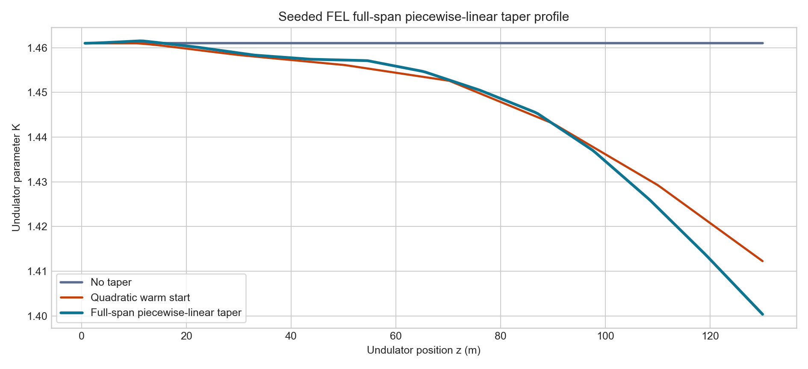

#### Power growth

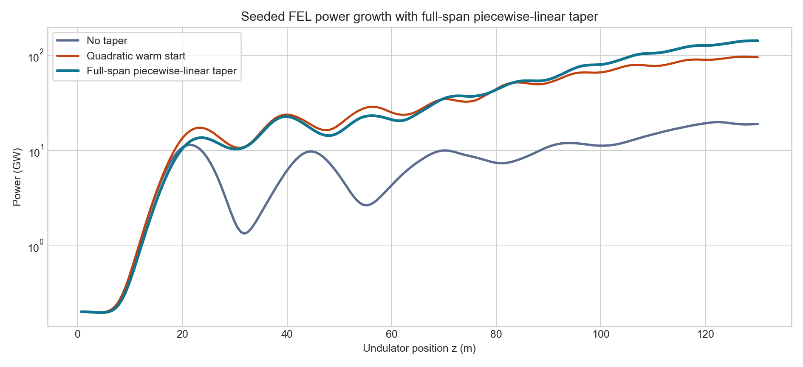

#### Optimization history

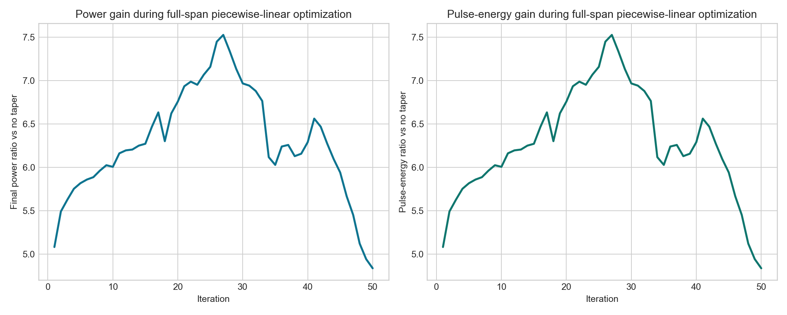

#### Notes

- Configuration:
  this run removes the taper-start parameter completely, fixes taper onset at `start_frac = 0`, and uses `12` piecewise-linear knot increments instead of the previous `6`.
- Configuration:
  the seed power remains `P0 = 2e8 W`, and the optimizer keeps the same differentiable penalties used in the earlier piecewise-linear run.
- Change from previous run:
  I warm-started from the best `7`-parameter piecewise-linear profile, projected it onto the denser `12`-knot full-span parameterization, and then optimized only the knot increments.
- Result:
  the no-taper baseline is `18.841 GW`, the `7`-parameter piecewise-linear warm start is `95.014 GW`, and the best full-span `12`-knot run reaches `141.803 GW`, or `7.526x` over no taper, at iteration `27`.
- Result:
  compared with the previous `7`-parameter piecewise-linear optimum, the full-span `12`-knot model improves final power by `46.789 GW`, which is `1.492x` better than the earlier piecewise-linear best.
- Result:
  the optimized taper deepens to `K_min = 1.400`, while starting immediately from `z = 0`.
- Lesson:
  for this `200 MW` case, fixing taper to start immediately is not a handicap. Once the piecewise-linear control is flexible enough, the optimizer can use the extra downstream shape freedom to outperform the earlier-start-optimized model.
- Lesson:
  doubling the piecewise-linear resolution helps materially. This is now the strongest evidence in the repo that richer differentiable control parameterizations can unlock substantially better seeded FEL taper solutions.
- Lesson:
  the best iterate occurs well before the final iteration, so keeping best-of-run tracking remains important for the higher-dimensional optimizer.
- Next step:
  use this `12`-knot full-span parameterization as the new gradient baseline and compare it against a derivative-free optimizer on the same control space.
- Optimizer-fix follow-up:
  I found that the Adam-style update in the seeded scripts was accidentally applied twice per iteration, which effectively doubled the step size and made the higher-dimensional runs much less stable than intended.
- Optimizer-fix change from previous run:
  I removed the extra second update and reran the `12`-knot full-span case cleanly into `docs/examples/generated_plots/seeded_gradient_piecewise_linear_fullspan_fix_p2e8_2026-04-15/`.
- Optimizer-fix result:
  the clean `12`-knot rerun reached `118.597 GW`, or `6.294x`, at iteration `20`.
- Optimizer-fix lesson:
  the bug fix changed the optimization path substantially, but this particular `12`-knot rerun did not beat the earlier buggy best of `141.803 GW`; it appears the previous result benefited from the more aggressive effective step in that specific control space.

### 2026-04-15: Seeded FEL full-span 24-knot piecewise-linear taper with 200 MW seed

Goal: double the full-span piecewise-linear control count from `12` to `24` while keeping taper start fixed at `0`, then test whether the denser control space improves beyond the current best `12`-knot result.

Artifacts for this run are generated by:

```bash
python scripts/seeded_gradient_piecewise_linear_fullspan.py
```

Plots and summaries are written to `docs/examples/generated_plots/seeded_gradient_piecewise_linear_fullspan24_p2e8_2026-04-15/`.

#### Taper profile

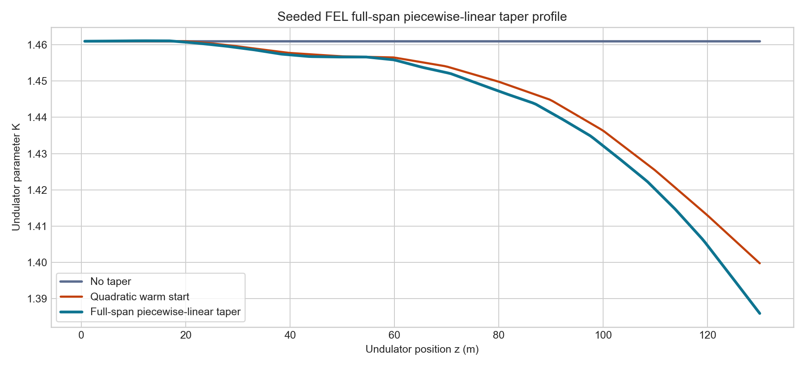

#### Power growth

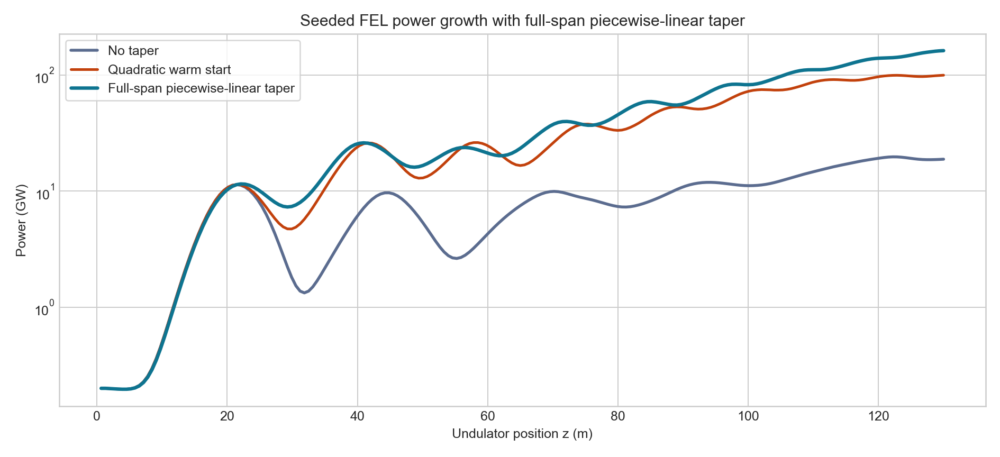

#### Optimization history

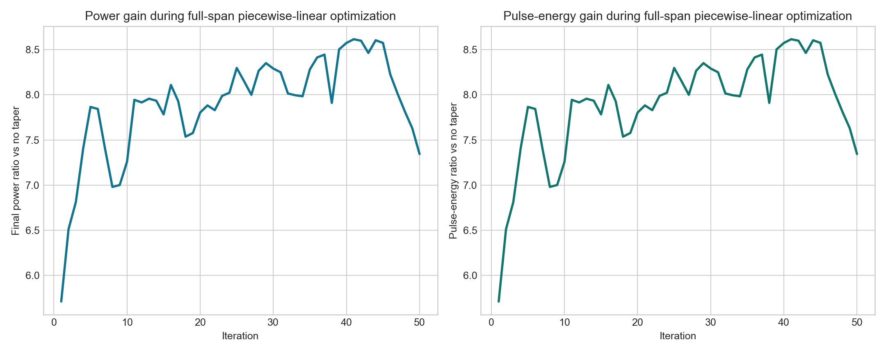

#### Notes

- Configuration:
  this run keeps taper start fixed at `0` and doubles the full-span piecewise-linear control resolution from `12` to `24` knot increments.
- Configuration:
  the seed power remains `P0 = 2e8 W`, and the optimizer uses the same differentiable objective as the `12`-knot full-span run.
- Change from previous run:
  I warm-started the `24`-knot model from the best `12`-knot full-span result by resampling that taper onto the denser knot grid.
- Result:
  the no-taper baseline is `18.841 GW`, the projected warm start is `99.740 GW`, and the best `24`-knot run reaches `129.092 GW`, or `6.852x` over no taper, at iteration `15`.
- Result:
  compared with the previous `12`-knot full-span best of `141.803 GW`, the `24`-knot run is worse by `12.712 GW`, or only `0.910x` of the `12`-knot best.
- Result:
  the run is much less stable than the `12`-knot case, with a strong early spike followed by substantial degradation at later iterations.
- Lesson:
  doubling the control count again does not automatically help. In this current optimization setup, the `24`-knot space is harder to navigate and underperforms the `12`-knot full-span parameterization.
- Lesson:
  the richer parameterization still finds a strong taper, but the optimizer is no longer using the extra degrees of freedom robustly. This looks like an optimization-stability limit rather than a pure expressivity limit.
- Lesson:
  the current best-known `200 MW` seeded result remains the `12`-knot full-span run at `141.803 GW` and `7.526x`.
- Next step:
  keep the `12`-knot full-span model as the main gradient baseline and only revisit `24` knots after retuning learning rate, regularization, or trust-region behavior for the larger control space.
- Optimizer-fix follow-up:
  after removing the accidental double-step in the optimizer, I reran the `24`-knot full-span case cleanly using the same physics setup.
- Optimizer-fix result:
  the clean `24`-knot rerun reached `162.318 GW`, or `8.615x`, at iteration `41`, written to `docs/examples/generated_plots/seeded_gradient_piecewise_linear_fullspan24_p2e8_2026-04-15/`.
- Optimizer-fix result:
  this is `1.257x` better than the earlier `24`-knot run and `1.145x` better than the old `12`-knot best, improving on the previous best-known result by `20.514 GW`.
- Optimizer-fix lesson:
  this clean rerun strongly supports the original expectation: the earlier failure of the larger control space was mostly an optimizer-implementation issue, not a fundamental limitation of gradient-based optimization with more variables.
- Optimizer-fix lesson:
  with the bug removed, the `24`-knot full-span parameterization is now the best-known `200 MW` seeded result in the repo.

### 2026-04-15: Seeded FEL full-span 32-knot piecewise-linear taper with 200 MW seed

Goal: extend the clean full-span parameterization from `24` to `32` knot increments and test whether the larger differentiable control space continues to improve the seeded `200 MW` result.

Artifacts for this run are generated by:

```bash
python scripts/seeded_gradient_piecewise_linear_fullspan32.py
```

Plots and summaries are written to `docs/examples/generated_plots/seeded_gradient_piecewise_linear_fullspan32_p2e8_2026-04-15/`.

#### Taper profile

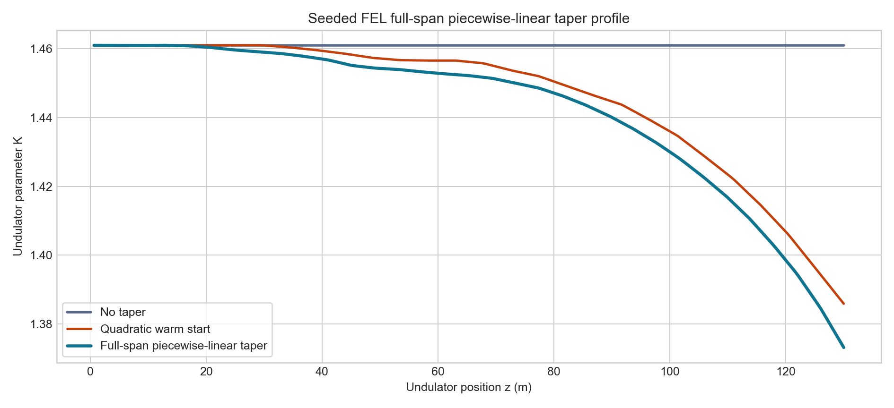

#### Power growth

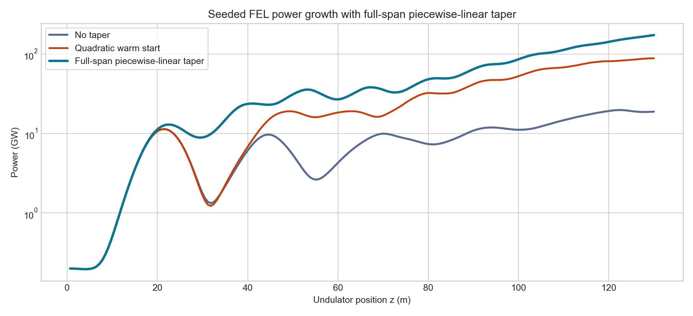

#### Optimization history

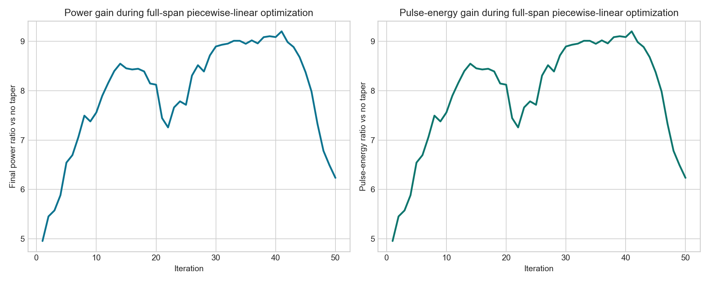

#### Notes

- Configuration:
  this run keeps taper start fixed at `0`, increases the full-span piecewise-linear control resolution to `32` knot increments, and uses the cleaned single-step Adam update.
- Change from previous run:
  I warm-started from the fixed `24`-knot full-span result by projecting that taper onto the denser `32`-knot grid.
- Result:
  the no-taper baseline is `18.841 GW`, the projected warm start is `88.271 GW`, and the best `32`-knot run reaches `173.416 GW`, or `9.204x` over no taper, at iteration `41`.
- Result:
  compared with the fixed `24`-knot best of `162.318 GW`, the `32`-knot run improves final power by `11.098 GW`, or `1.068x`.
- Result:
  the optimized taper deepens further to `K_min = 1.373`, while keeping taper start fixed at `0`.
- Lesson:
  with the optimizer bug removed, the larger differentiable control space continues to help through at least `32` full-span knot increments.
- Lesson:
  the projected warm start loses some power when moving from `24` to `32` knots, but the optimizer is able to recover and surpass the previous best, which is a strong sign that the added variables are being used productively rather than just creating noise.
- Lesson:
  this is now the best-known `200 MW` seeded result in the repo and the clearest evidence so far that gradient-based optimization is benefiting from increased control resolution in this FEL taper problem.
- Next step:
  continue the control-space sweep carefully from this cleaned optimizer baseline, or start a matched comparison against derivative-free search on the same `32`-knot parameterization.

### 2026-04-14: Differentiable vs derivative-free taper optimization

Goal: compare whether the differentiable FEL workflow reaches better taper solutions than non-differentiable search under a matched taper parameterization.

Artifacts for this run are generated by:

```bash
python scripts/run_differentiable_benchmark.py
python scripts/render_differentiable_benchmark_plots.py
```

Plots and summaries are written to `docs/examples/generated_plots/benchmark_run_2026-04-14/`.

#### Progress

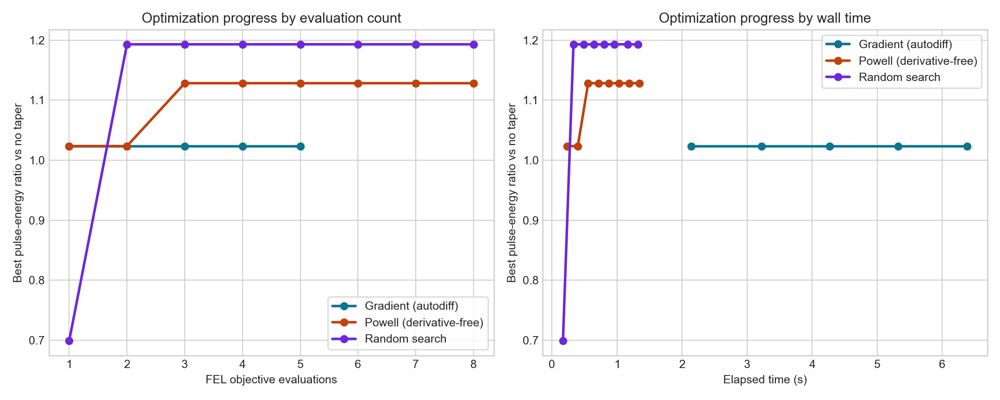

#### Best profiles and power growth

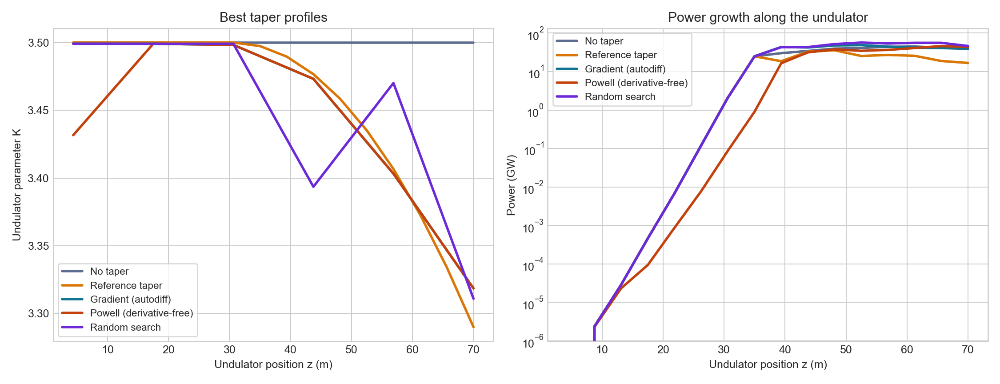

#### Held-out stochastic validation

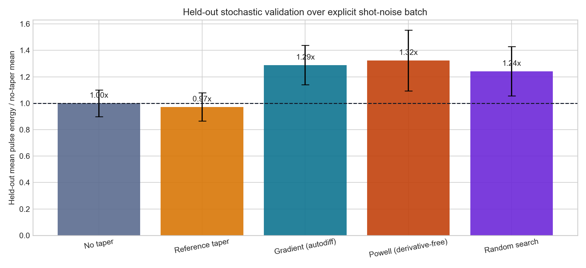

#### Robustness tradeoff

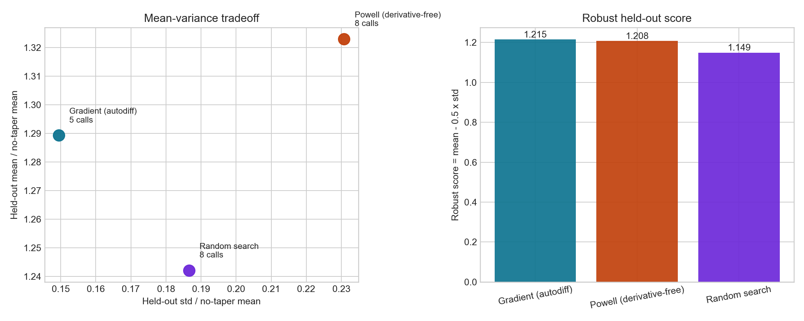

#### Notes

- This run used a lightweight recurring benchmark configuration: `npart=64`, `s_steps=16`, `z_steps=16`, 6 taper controls, 5 gradient steps, and 8 calls for each derivative-free baseline.
- Deterministic best pulse-energy ratio vs no taper:
  `Gradient` 1.023x, `Powell` 1.128x, `Random` 1.193x.
- Held-out stochastic mean ratio vs no taper:
  `Gradient` 1.289x, `Powell` 1.323x, `Random` 1.242x.
- The hand reference taper was not a strong baseline in this reduced setting: 0.433x deterministic and 0.972x held-out mean.
- Interpretation:
  this first automated benchmark proves the workflow, but not yet the final scientific claim. The next stronger comparison should increase resolution and tune budgets so gradient information has enough room to outperform derivative-free search.
- The strongest current positive signal is robustness:
  `Gradient` beat `Random search` on held-out mean with fewer evaluations, and its held-out robust score `mean - 0.5 x std` is slightly better than `Powell` because Powell bought extra mean with noticeably higher shot-to-shot spread.
- Keep the comparison fair by matching the control parameterization and reporting either simulator-call budgets or wall-clock time.
- For stochastic SASE studies, always report held-out mean and spread on an explicit noise batch rather than only the training objective.
